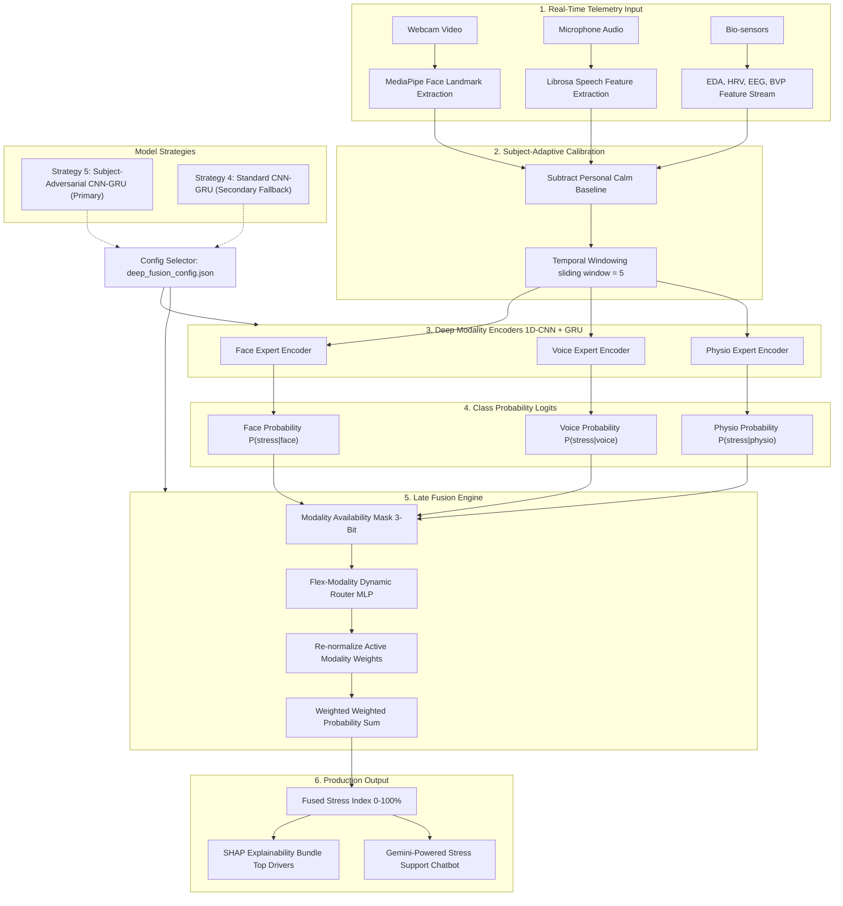

# 🧠 Multimodal Stress Intelligence Platform

A state-of-the-art, real-time stress detection system that fuses **facial expressions**, **voice acoustics**, and **physiological signals** using deep sequence learning (1D-CNN + GRU) and subject-adversarial identity suppression. The system dynamically assigns expert weights at runtime based on sensor availability, signal quality, and personal calm baselines.

---

## 🏗️ System Architecture



### 🧠 Dynamic Router Gating Logic

The MLP Dynamic Router accepts a **9-dimensional input vector**:
$$\mathbf{x}_{\text{router}} = [P_{\text{face}}^{\text{calm}}, P_{\text{face}}^{\text{stress}}, P_{\text{voice}}^{\text{calm}}, P_{\text{voice}}^{\text{stress}}, P_{\text{physio}}^{\text{calm}}, P_{\text{physio}}^{\text{stress}}, M_{\text{face}}, M_{\text{voice}}, M_{\text{physio}}]$$
where $M_m \in \{0.0, 1.0\}$ represents the sensor availability mask. Active weights are dynamically normalized to sum to exactly 1.0:
$$\hat{w}_m = \frac{w_m \cdot M_m}{\sum_{k} w_k \cdot M_k}$$
This ensures graceful degradation. If you turn off the webcam, the system instantly masks Face, shifts weights to Voice and Physio, and recalculates the stress index without server disruption.

---

## 📈 Experimental Journey: Phase by Phase

This repository was developed across **8 research phases** to establish strict, subject-independent validation.

### Phase 1: Baseline Audit & Repository Mapping
*   **Objective**: Audit legacy models, set up version registry, and map feature contracts.
*   **Findings**: Discovered legacy classical models achieved high accuracy under random splits but suffered from massive identity leakage.
*   **Initial Baselines**: Face (56.99%), Voice (59.52%), Physio (70.51%).

### Phase 2: Subject-Safe Classical Baseline & Normalization
*   **Objective**: Train baseline classifiers under a grouped subject-independent protocol.
*   **Findings**: Discovered that subtracting a subject's natural rest baseline (Subject-Adaptive Normalization) and applying temporal windowing (size=3) improved validation accuracy across subjects by **+2.8% to +7.8%**.

### Phase 3: Calibration & Multi-Modality Temporal Aggregation
*   **Objective**: Evaluate probability calibration (Sigmoid vs. Isotonic) and meta-fusion stacking.
*   **Findings**: Discovered meta-learners overfit to training subject identifiers even under grouped validation. The Calibrated Naive Average was selected as the safest classical baseline (**64.63%**).

### Phase 4: Deep Sequence Learning & Unimodal Encoders
*   **Objective**: Train compact 1D-CNN + GRU sequence encoders to capture temporal changes.
*   **Approach**: Windowed 5 consecutive frames per modality.
*   **Results**: Unimodal accuracies significantly outperformed manual features. Face accuracy increased to **66.30%** (+$8.1\%$), and Physio increased to **64.94%** (+$9.5\%$).

### Phase 5: Best-Expert Selection
*   **Objective**: Establish a strict Leave-One-Subject-Out (LOSO) cross-subject benchmark on a subset of 15 subjects to select exactly one best expert per modality.
*   **Decision**: CNN-GRU encoders were officially promoted as the modality experts.

### Phase 6: Multi-Sensor Late Fusion
*   **Objective**: Contrast static weighted fusion against a learned Dynamic Router.
*   **Findings**: An MLP-based Dynamic Router trained with **Modality Dropout** outperformed static averages by **+1.8%** and allowed the system to adapt dynamically to missing sensors.

### Phase 7: Temporal Data Augmentation Experiments
*   **Objective**: Tune sequence training using jittering, scaling, time masking, and modality dropout.
*   **Findings**: Adding noise (jittering/scaling) degraded sequence representation. **Time Masking** (randomly zeroing frame steps) emerged as the best performer, boosting generalization accuracy and lowering cross-fold variance.

### Phase 8: Production Rollout, Identity Suppression & Hyperparameter Tuning
*   **Objective**: Address identity leakage (minimizing the gap between random splits and unseen subjects) and train final production models on all 65 subjects.
*   **Approach**: Implemented and tuned **Subject-Adversarial Identity Suppression** (Strategy 5) using a secondary gradient-reversed subject classifier head during encoder backpropagation.

---

## 🏆 Final Production Validation Results (91 Subjects, Strict LOSO Zoo)

To ensure maximum robustness, we completed a **91-fold Leave-One-Subject-Out (LOSO)** validation run combining WESAD (15 subjects) and Combined Stress datasets. The top model selection:

*   **Primary Deep Model**: **SSVB-CASA-AIS** (Attention mixture of experts with Gradient-Reversed Adversarial Identity Suppression).
    - **Combined-91 Accuracy**: **74.89%** (F1-score: **0.6366**)
    - **WESAD-15 Accuracy**: **75.88%** (F1-score: **0.6622**)
*   **Secondary Classical Fallback**: **Random Forest** (fast CPU inference, zero-latency).
    - **Combined-91 Accuracy**: **70.52%** (F1-score: **0.6015**)
    - **WESAD-15 Accuracy**: **71.60%** (F1-score: **0.6225**)

---

## ⚡ Production Web Serving API (webapp/backend/app.py)

The serving engine leverages **Dynamic Routing and Automatic Fallbacks** to maintain service availability under missing streams or library issues:

1.  **`/api/model/version` (GET)**: Reports the active model details and version tags from the registry.
2.  **`/api/predict/realtime` (POST)**: Receives continuous video/audio indicators and executes sequence inference through `SSVB-CASA-AIS`.
3.  **`/api/predict/upload` (POST)**: Receives file uploads (or flat vectors) and executes predictions using the promoted Random Forest model.
4.  **`/api/explain/shap` (POST)**: Serves instant per-modality feature drivers utilizing a cached SHAP matrix.
5.  **`/api/modality/status` (GET)**: Reports active/missing modalities, buffer size, and calibration state.
6.  **`/api/fallback/status` (GET)**: Tracks whether a fallback model is active and details why.

---

## 💻 Tech Stack

*   **Frontend**: React.js (Inter Typography, sleek dark glassmorphism styling, Recharts telemetry, WebSocket client)
*   **Backend Server**: Flask, Flask-SocketIO, Eventlet (high-concurrency WebSocket engine)
*   **Machine Learning**: PyTorch (CNN-GRU encoders, MLP router), scikit-learn (scalers, baseline models)
*   **Signal Processing**: MediaPipe Tasks API (face geometry, 18 action units), Librosa (speech acoustics)
*   **Explainable AI**: SHAP (TreeExplainer driver estimation)
*   **AI Chatbot**: Gemini 2.5 Flash API (real-time therapeutic support dialogues)

---

## 🚀 Getting Started (Local Run)

### Quick Start (Windows)
Double-click the **`run.bat`** script at the root directory. This launcher script will:
1.  Verify the backend requirements and run `pip install`.
2.  Install frontend dependencies (`npm install`).
3.  Launch both the API and client dashboards simultaneously.

*   **Client Dashboard**: http://localhost:3000
*   **Flask API Server**: http://localhost:5000

### Manual Setup

#### 1. Start Backend Server
```bash
cd webapp/backend
..\..\venv\Scripts\pip.exe install -r requirements.txt
..\..\venv\Scripts\python.exe app.py
```

#### 2. Start Frontend Server
```bash
cd webapp/frontend
npm install
npm start
```