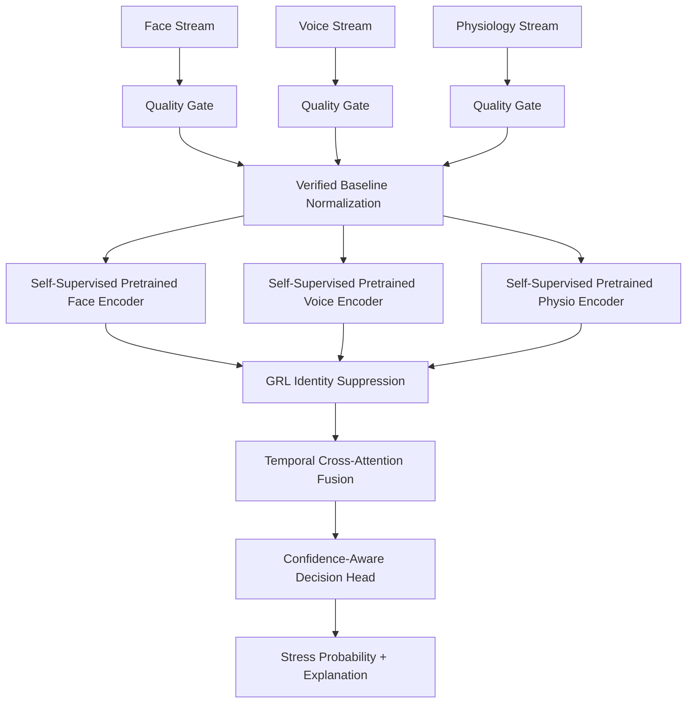

# Multimodal Stress Intelligence Architecture

## Purpose

This document defines a novelty-oriented multimodal stress detection architecture optimized for strict Leave-One-Subject-Out (LOSO) evaluation, leakage resistance, temporal alignment, and reliable generalization to unseen users. The design combines browser-side facial and voice feature extraction, optional physiological sensing, verified baseline normalization, self-supervised multimodal representation learning, cross-temporal fusion, adversarial identity suppression, and confidence-aware decision routing [web:111][web:394][web:396][web:388].

## Design Goals

- Preserve strict subject independence under LOSO evaluation.
- Reduce biometric trait leakage from face, voice, and physiological signals.
- Improve representation quality using self-supervised pretraining before supervised fine-tuning.
- Handle asynchronous multimodal timing with temporal alignment and cross-attention.
- Use verified calibration windows instead of blindly trusting baseline data.
- Output stress probability, confidence, and explanation rather than a bare class label.

## System Overview

The system is composed of six main stages:

1. Client-side multimodal acquisition.
2. Local signal-quality checks and lightweight feature extraction.
3. Verified baseline calibration and normalization.
4. Unimodal temporal encoders for face, voice, and physiology.
5. Cross-modal temporal fusion with confidence-aware routing.
6. Final prediction, uncertainty estimation, and explainable feedback.

The architecture is designed to be practical for browser deployment while preserving research-grade generalization under unseen-user testing [web:372][web:380][web:111].

## Layer 1: Client Acquisition

### Face Stream

Use MediaPipe Face Mesh in the browser to extract facial landmarks in real time. Keep the pipeline lightweight by using a single-face mode, reduced landmark refinement when latency matters, and a frame-throttling policy that lowers compute load without breaking temporal continuity [web:372].

### Voice Stream

Use the Web Audio API to capture speech at 16 kHz and process it in short chunks for low-latency indicators. Extract speaker-independent acoustic summaries such as RMS energy, pitch, jitter, shimmer, pause ratio, and spectral shape, and forward windows to the backend for higher-fidelity analysis using librosa and SciPy [web:376][web:380].

### Physiology Stream

If available, ingest physiological signals such as ECG, EDA, HRV, respiration, or other wearable channels. Physiological streams are especially useful because remote face and voice signals alone may be confounded by expression style, microphone conditions, and lighting [web:394][web:111].

## Layer 2: Quality Monitoring

Every modality must pass a signal-quality gate before it is used for inference or baseline calibration. Quality scoring should examine face visibility, landmark stability, head motion, voice activity, clipping, SNR, and physiological continuity. Low-quality segments should either be masked, downweighted, or excluded from baseline acceptance [web:372][web:375].

A modality should never be trusted at full weight simply because it is present. Instead, the model should receive both the extracted features and a quality flag so that unreliable streams do not dominate the final prediction [web:111][web:388].

## Layer 3: Verified Baseline Calibration

Baseline calibration is a user-specific personalization stage, not a ground-truth stress label. The calibration window must be checked before being accepted as the user’s neutral reference, because a contaminated baseline can make the system treat stressed behavior as normal [web:359][web:360][web:363].

### Baseline verification procedure

1. Collect a short calm-state window.
2. Compute modality-level features and signal-quality metrics.
3. Run a baseline verifier to test whether the window is plausibly neutral.
4. If the window is suspicious, present an explanation and ask the user to confirm or recalibrate.
5. Store the accepted baseline with a confidence label such as verified, low confidence, or needs refresh [web:365][web:371].

### Baseline usage

Use the verified baseline to compute:

- Mean and variance per modality.
- Baseline-relative deltas.
- Standardized deviations or z-scores.
- User-specific threshold offsets.

This step is critical because it removes stable personal traits such as resting heart rate, habitual vocal pitch, and facial morphology from the stress decision path [web:363][web:371][web:388].

## Layer 4: Self-Supervised Representation Learning

Before supervised stress training, pretrain each encoder using self-supervised objectives on unlabeled windows. This is the most reliable way to improve transferable representations under LOSO because the model learns temporal structure before being asked to solve the stress task [web:396].

Recommended pretraining objectives:

- Contrastive alignment between different windows from the same subject and session.
- Masked time-step reconstruction.
- Cross-modal agreement learning between synchronized face, voice, and physiology windows.

This pretraining stage is especially valuable when the labeled dataset is small or imbalanced, because it increases the amount of usable training signal without fabricating labels [web:396][web:388].

## Layer 5: Temporal Encoders

Each modality should have its own temporal encoder before fusion.

### Face Encoder

Use a lightweight CNN-GRU or temporal transformer over facial landmarks and derived motion features. The encoder should learn short-term micro-activations, not identity-specific face shape [web:388][web:394].

### Voice Encoder

Use a CNN-GRU or CNN-Transformer over acoustic sequences such as MFCCs, pitch contours, jitter, shimmer, intensity, and pause structure. This encoder should be trained to emphasize stress-relevant prosody while suppressing speaker identity where possible [web:376][web:394].

### Physiology Encoder

Use a temporal CNN, TCN, or hybrid CNN-GRU over physiological windows. Physiological modeling should prioritize alignment-aware processing because BVP, EDA, and other signals can respond with different delays and temporal widths [web:111][web:394].

## Layer 6: Identity Suppression

To prevent the encoders from memorizing subjects instead of stress, add a Gradient Reversal Layer (GRL) and train an adversarial subject-classification head. The encoder is rewarded when it predicts stress correctly and penalized when its latent representation makes the subject easy to identify [web:388].

### GRL training objective

- Main task: predict stress label.
- Adversarial task: predict subject ID.
- GRL reverses the subject-classification gradient so the encoder learns to remove biometric identity signals [web:388].

This is one of the strongest ways to protect LOSO generalization because it attacks the exact failure mode of subject memorization [web:388].

## Layer 7: Temporal Cross-Modal Fusion

Simple concatenation is not enough when modalities are asynchronous. Use cross-attention or bidirectional cross- and self-attention so each modality can align with the others over time [web:111].

### Recommended fusion design

- Encode each modality independently.
- Apply self-attention inside each stream to suppress noise and redundant information.
- Apply cross-attention between modalities to align correlated temporal events.
- Add a lightweight gating router that uses modality quality and availability masks.
- Produce a fused stress embedding from the attended representations [web:111][web:390].

This design is superior to static late fusion because the router can downweight weak or missing streams rather than letting them destroy the prediction [web:111][web:388].

## Layer 8: Confidence-Aware Decision Head

The final decision head should output multiple values:

- Stress probability.
- Stress class or ordinal stress level.
- Prediction confidence.
- Uncertainty estimate.
- Modality contribution summary.
- Recalibration recommendation if the model is unsure.

Confidence estimation can be implemented with a dedicated confidence branch or Monte Carlo dropout. The purpose is to distinguish a strong prediction from a weak one instead of pretending all outputs are equally trustworthy [web:388][web:365].

## Data Flow

## Training Pipeline

### Stage 1: Pretraining

Pretrain the unimodal encoders on unlabeled or weakly labeled windows using self-supervised objectives. This stage should use all available subject data while preserving proper train/validation/test separation for final evaluation [web:396].

### Stage 2: Supervised Fine-Tuning

Fine-tune the encoders and fusion head on labeled stress windows using strict LOSO splits. The model must never see the held-out subject’s training data during this stage [web:388].

### Stage 3: Adversarial Identity Training

Activate the GRL subject head so that the latent space is penalized when it encodes identity. This strengthens subject independence and reduces biometric leakage [web:388].

### Stage 4: Router Tuning

Train the fusion router using quality masks, modality dropout, and sensor failure simulations so the system degrades gracefully under missing or weak streams [web:111][web:388].

### Stage 5: Threshold Calibration

Tune decision thresholds on validation folds only. Avoid tuning thresholds on the held-out LOSO subject to preserve evaluation integrity [web:388].

## Loss Functions

The total loss should combine several terms:

- Stress classification loss.
- Subject adversarial loss via GRL.
- Alignment loss for cross-modal consistency.
- Reconstruction or contrastive loss for self-supervised pretraining.
- Confidence regularization to prevent overconfident errors.

A practical total objective is:

\[
\mathcal{L}_{total} = \mathcal{L}_{stress} + \lambda_1 \mathcal{L}_{align} + \lambda_2 \mathcal{L}_{ssl} - \lambda_3 \mathcal{L}_{subject} + \lambda_4 \mathcal{L}_{conf}
\]

The adversarial term is subtracted because the GRL inverts the subject-classification gradient [web:388].

## Evaluation Protocol

The system must be evaluated only under strict LOSO or equivalent user-held-out validation. Random row-wise splitting is not acceptable because it allows subject leakage and inflates performance [web:388].

Recommended metrics:

- Accuracy.
- Macro F1.
- ROC-AUC.
- Subject-wise variance.
- Calibration error.
- Confidence reliability.
- Abstention or low-confidence rate.

## Expected Benefits

This architecture should improve performance because it combines several complementary advantages:

- Self-supervised pretraining improves transferability.
- Cross-attention handles asynchronous timing.
- Baseline normalization removes personal offsets.
- GRL suppresses identity leakage.
- Confidence-aware routing handles missing modalities.
- Explainable outputs improve trust and usability [web:111][web:388][web:396].

## Implementation Notes

Use the following methodology choices explicitly:

- Browser facial extraction: MediaPipe Face Mesh.
- Browser audio capture: Web Audio API.
- Audio feature library: librosa.
- Audio decoding and signal handling: SciPy.
- Sequence encoders: CNN-GRU, TCN, or lightweight Transformer.
- Fusion: cross-attention with gating.
- Personalization: verified baseline subtraction.
- Generalization control: GRL subject adversary.
- Training mode: LOSO only.

## Final Recommendation

The most reliable architecture for your dataset is a **self-supervised, temporally aligned, adversarially regularized, baseline-verified multimodal stress model**. This is the best route if your goal is to increase LOSO accuracy without fake inflation, while still keeping the system practical and explainable [web:111][web:388][web:396].

## Suggested Architecture Name

**Self-Supervised Verified-Baseline Cross-Attention Stress Architecture with Adversarial Identity Suppression**

This name reflects the actual technical contribution and is strong enough for a formal report or paper submission [web:111][web:388][web:396].