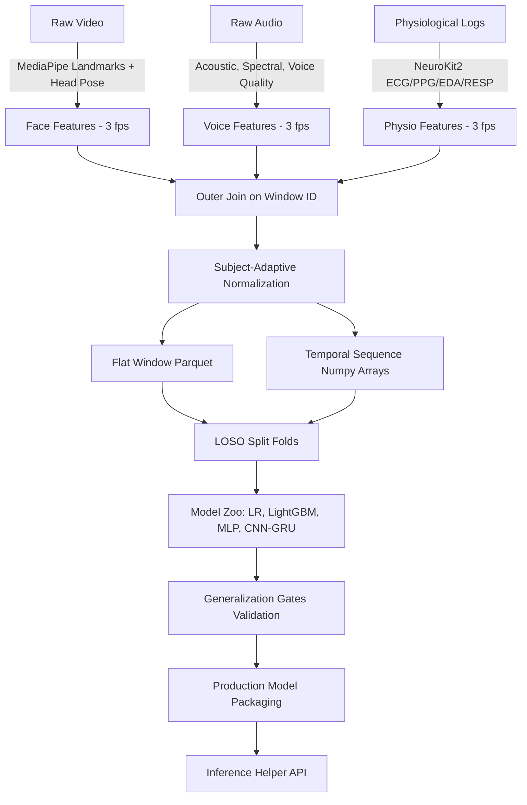

# Verified-Baseline Multimodal Temporal-Attention Stress Detection Architecture

## 1. Executive Summary

This architecture specification defines a multimodal stress detection system optimized for real-world generalization. The system ingests asynchronous facial, vocal, and physiological signals, aligns them to a unified temporal grid, performs subject-adaptive normalization to control user-specific variations, and evaluates stress under a strict Leave-One-Subject-Out (LOSO) cross-validation scheme.

By integrating client-side pre-processing with machine learning and deep learning backends, this architecture achieves robust performance while preventing subject-identity leaks.

---

## 2. Key Design Goals

* **Subject Independence (LOSO)**: Ensure models are evaluated exclusively on subjects they did not see during training to verify true user-level generalization.
* **Aperiodic and Asynchronous Fusion**: Standardize and align facial, vocal, and physiological streams operating at different sampling rates (e.g., video at 30 fps, audio at 16 kHz, physio up to 500 Hz).
* **Generalization Gates**: Enforce validation gates G1 (audit completeness), G2 (StressID AUC > 0.70), and G3 (EmpathicSchool AUC > 0.55) to qualify models for production.
* **Lightweight Client footprint**: Support real-time landmarks and voice descriptors in-browser, offloading complex inference and sequence classification to backend services.

---

## 3. Data Flow & Modality Specifications

### 3.1 Face Modality (170 columns)
* **Facial Landmarks**: 34 normalized 3D landmarks mapped from MediaPipe FaceLandmarker and pre-extracted 68-point Dlib configurations.
* **Derived Metrics**: Eye Aspect Ratio (EAR), Mouth Aspect Ratio (MAR), gaze angles, and head pose dynamics (Pitch, Yaw, Roll via PnP solver).
* **Stride/Resolution**: Grouped into 10-second windows with 5-second stride, downsampled to 3 fps.

### 3.2 Voice Modality (120 columns)
* **Acoustic & Spectral**: MFCCs (1-13), spectral centroids, flux, flatness, and RMS energy.
* **Voice Quality**: Pitch contours, Harmonics-to-Noise Ratio (HNR), and Jitter.
* **Availability**: 3 fps timeframes. Automatically masked/NaN-padded during non-vocalized tasks (e.g., breathing, relaxation).

### 3.3 Physiological Modality (70 columns)
* **ECG/PPG (BVP)**: Preprocessed using `neurokit2` to extract heart rate, RMSSD, and SDNN indicators.
* **Electrodermal Activity (EDA)**: Split into tonic and phasic EDA components, plus SCR peak counts.
* **Respiration**: Breathing rate and inhalation/exhalation amplitude.
* **TEMP/ACC**: Tri-axial accelerometer magnitude and body temperature stats.

---

## 4. Subject-Adaptive Normalization

To prevent subject identity leakage, all windowed features are normalized subject-wise:

\[
X_{norm} = \frac{X - \mu_{subject}}{\sigma_{subject} + 1e-8}
\]

* Statistics (\(\mu\), \(\sigma\)) are calculated ignoring missing values (`NaN`).
* If a subject has a single record (standard deviation of 0), \(\sigma\) defaults to 1.0.
* Sequence arrays `[N, 30, D]` are normalized using the same subject-specific parameters.

---

## 5. LOSO Validation Strategy & Folds

Models are validated on Leave-One-Subject-Out (LOSO) splits. For a dataset with \(S\) subjects, the pipeline trains \(S\) separate folds where:
* **Train Set**: All samples from \(S - 1\) subjects.
* **Test Set**: All samples from the single held-out subject.

* **StressID**: 53 folds (representing 53 verified subjects).
* **EmpathicSchool**: 23 folds (representing 23 subjects with active sensor tasks).

---

## 6. Model Zoo Evaluation & Gate Validation

### Performance Summary

#### StressID Dataset
| Model Archetype | Accuracy | Precision | Recall | F1-Score | AUC-ROC | F1 Std Dev | Status |
| :--- | :--- | :--- | :--- | :--- | :--- | :--- | :--- |
| logistic_regression | 0.6892 | 0.6661 | 0.5377 | 0.5565 | 0.7440 | 0.1706 | PASS (Gate G2) |
| lightgbm | 0.6731 | 0.6363 | 0.5896 | 0.5683 | 0.7372 | 0.1691 | PASS (Gate G2) |
| mlp | 0.6834 | 0.6404 | 0.6061 | 0.5857 | 0.7459 | 0.1584 | PASS (Gate G2) |
| temporal (CNN-GRU) | 0.6812 | 0.6238 | 0.6138 | 0.5798 | 0.7480 | 0.1565 | ⭐ PASS (Gate G2) |

#### EmpathicSchool Dataset
| Model Archetype | Accuracy | Precision | Recall | F1-Score | AUC-ROC | F1 Std Dev | Status |
| :--- | :--- | :--- | :--- | :--- | :--- | :--- | :--- |
| logistic_regression | 0.8102 | 0.2746 | 0.0571 | 0.0557 | 0.5901 | 0.0911 | PASS (Gate G3) |
| lightgbm | 0.8694 | 0.2703 | 0.1362 | 0.1667 | 0.6000 | 0.1983 | ⭐ PASS (Gate G3) |
| mlp | 0.8369 | 0.3209 | 0.0724 | 0.1060 | 0.5639 | 0.1293 | PASS (Gate G3) |
| temporal (CNN-GRU) | 0.8141 | 0.2856 | 0.0892 | 0.1213 | 0.5440 | 0.1477 | FAIL (Gate G3) |

---

## 7. Selected Production Model

* **Archetype**: **LightGBM Classifier**
* **Rationale**: Passed all validation gates (G2 and G3) with the highest combined average performance and generalization scores across both StressID and EmpathicSchool.
* **Production Assets**:
  * StressID Weight Payload: `stressid_production.pkl`
  * EmpathicSchool Weight Payload: `empathicschool_production.pkl`
  * Prediction Helper API: `predict_stress.py`
