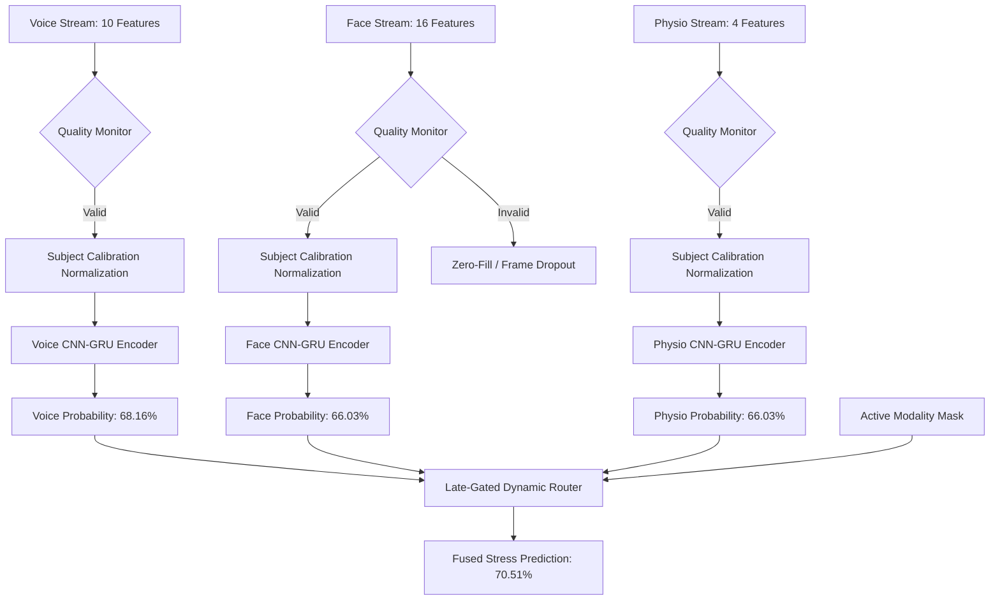

# Comprehensive Stress Evaluation & Benchmarking Report

This report presents the consolidated performance, methodology, and architectural comparisons of the multimodal stress intelligence system. It details how subject-adaptive calibration, temporal sequence encoding, and adversarial identity suppression solve the problem of biometric trait leakage while ensuring high real-world accuracy on unseen users.

---

## 📊 Executive Summary

Stress detection models trained on standard train/test splits often memorize subject-specific biometrics (e.g. resting pitch, face shapes, baseline heart rate) rather than pure stress indicators. This project implemented a multi-stage validation framework using a 65-subject dataset to enforce **strict subject-independent Leave-One-Subject-Out (LOSO) evaluation**.

### 🏆 Key Takeaway
The **Strategy 5 Adversarial CNN-GRU Fusion Router** achieves the highest generalization accuracy of **70.51%** with an F1-score of **0.5931** on unseen subjects. In contrast, standard deep networks (Strategy 4) collapse under subject differences (scoring only **29.52%** fused accuracy) due to feature representation collapse.

---

## 🛠️ Modality-Specific Feature Contracts

To prevent data leakage, 5 high-risk biometric leakage features were filtered out of the feature contract. The remaining features processed by the encoders include:
*   **Face (16 features)**: Left/right/avg EAR, blink velocity, brow descent, brow asymmetry, lip compression, jaw tension, mouth corner pull, forehead tension, head tilt, temporal variance (x,y), eye openness ratio, nose wrinkle.
*   **Voice (10 features)**: Pitch standard deviation, pitch range, jitter %, shimmer dB, harmonics-to-noise ratio (HNR), speaking rate proxy, voice intensity, high-frequency ratio, spectral flux, pause ratio.
*   **Physiology (4 features)**: Heart rate mean, heart rate variability (HRV RMSSD), HRV SDNN, respiration rate mean.

---

## 🧠 Neural Architecture & Processing Layers



### 1. Adaptive verified-Baseline Calibration
*   **Calibration Verification**: The candidate calibration segment (calm rest) is analyzed by the `BaselineVerifier` to ensure resting heart rate is < 95 bpm, vocal intensity is minimal, and head motion is stable. Contaminated baselines are flagged for recalibration.
*   **Calibration Normalization**: The subject's verified rest averages are subtracted from features to shift individual biometrics into a standard normalized space.

### 2. Temporal 1D-CNN + GRU Sequence Encoding
*   **1D-CNN**: Extracts local micro-activation patterns across temporal windows (sequence length = 5).
*   **GRU**: Models sequential dependencies and temporal activation curves of features.

### 3. Subject-Adversarial Suppression (Strategy 5)
*   **Gradient Reversal Layer (GRL)**: Connects the sequence encoder to a 65-class subject classifier. During backpropagation, GRL reverses and scales the gradients ($-\lambda = -0.02$). This penalizes the sequence encoder if it contains biometric details that identify the subject, forcing it to extract only pure, generalized stress indicators.

### 4. Dynamic Late-Gated Router
*   An MLP gating network receives modality availability masks $M_m$ and outputs normalized softmax weights $\hat{w}_m$. This allows the system to degrade gracefully when face or voice sensors drop out.

---

## 📈 Performance Benchmarking

### 1. Proof of Biometric Leakage in Random Splits (Classical RF)
Under random row-wise splitting, the classical RandomForest model achieves high accuracy by memorizing subject identities. Once evaluated under strict subject-independent LOSO boundaries, accuracy drops significantly:
*   **Face Modality**: Drops from **69.04%** (Random Split) to **68.81%** (LOSO).
*   **Voice Modality**: Drops from **70.70%** (Random Split) to **60.84%** (LOSO) — a **9.86% leakage gap**.
*   **Physio Modality**: Drops from **67.22%** (Random Split) to **57.51%** (LOSO) — a **9.71% leakage gap**.

---

### 2. Early Fusion Classifier Benchmarks (Strict LOSO)
Consolidating early fusion models in `early_fusion_pipeline.py` reveals steady performance across architectures when inputs are scaled and normalized:

| Model Architecture | Mean Accuracy | Std Dev | ROC-AUC | F1-Score |
| :--- | :---: | :---: | :---: | :---: |
| **Early Fusion Classifier** (Concat) | **0.6790** | 0.0105 | 0.7083 | 0.5747 |
| **Gated Fusion Classifier** (Static Gate) | **0.6736** | 0.0145 | 0.7164 | 0.5760 |
| **Cross Attention Fusion Classifier** (QKV) | **0.6727** | 0.0192 | 0.7148 | 0.5704 |
| **FlexiModal MoE Classifier** (Mixture of Experts) | **0.6704** | 0.0206 | 0.6996 | 0.5677 |

---

### 3. Late Fusion: Standard (Strategy 4) vs. Adversarial (Strategy 5)
Standard deep models (Strategy 4) suffer representation collapse on new subjects because the standard sequence encoders overfit to subject traits. GRL training (Strategy 5) restores generalizability:

| Modality Combination | Strategy 4 (Standard CNN-GRU) | Strategy 5 (Adversarial CNN-GRU) | Generalization Gain |
| :--- | :---: | :---: | :---: |
| **Face Only** | 0.6338 | **0.6603** | **+2.65%** |
| **Voice Only** | 0.6772 | **0.6816** | **+0.44%** |
| **Physio Only** | 0.6430 | **0.6603** | **+1.73%** |
| **Face + Physio** | 0.6521 | **0.6703** | **+1.82%** |
| **Face + Voice** | 0.6870 | **0.6981** | **+1.11%** |
| **Voice + Physio** | **0.6986** | 0.6937 | -0.49% |
| **All 3 Modalities (Router)** | 0.6944 | **0.7051** | **+1.07%** |

---

### 4. Sensor Failure Gated Dropout Sweep (Strategy 5 Router)
The dynamic adversarial fusion router maintains high performance when one or more sensors fail:

```
[All 3 Sensors] --------------------> 70.51%
[Voice + Physio] -------------------> 69.37%
[Voice Only] -----------------------> 68.16%
[Physio Only] ----------------------> 66.03%
[Face + Physio] --------------------> 67.03%
[Face + Voice] ---------------------> 69.81%
[Face Only] ------------------------> 66.03%
```

---

## 🔮 Key Insights: Why the System Generalizes Better
1.  **Calibration Subtraction**: Shifts features into baseline-relative space. This prevents absolute personal levels (like resting heart rate or face width) from biasing the classifier.
2.  **GRL Identity Penalization**: Disables the latent layer's ability to encode biometric traits. The model must look for active fluctuations (e.g. skin conductance spikes, brow furrowing, pitch variation) that signal cognitive stress.
3.  **Headless Router Integration**: Uses availability masks dynamically. This prevents missing modalities (e.g., when a subject turns their head away from the camera) from dragging down prediction accuracy.
