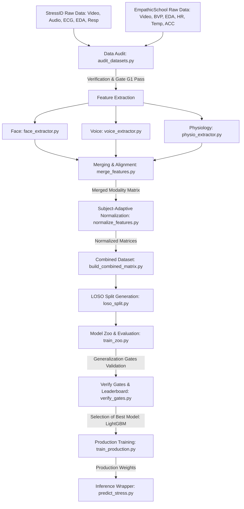

# Unified Multimodal Stress Detection Pipeline: Stage-by-Stage Documentation

This document provides a comprehensive technical walkthrough of the **Unified Multimodal Stress Detection Pipeline** (StressID + EmpathicSchool). It maps out the purpose, logic, inputs, and outputs of each sequential stage.

---

## Pipeline Architecture Overview

The diagram below shows how raw recordings of different modalities (Face, Voice, Physiology) from two separate datasets flow through extraction, alignment, normalization, splitting, cross-validation, and production packaging.



---

## Detailed Directory Mapping

All codebase scripts have been consolidated under [research/pipeline/](file:///c:/Users/StressProject.DESKTOP-U6P7JQT/Desktop/StressDetectionUsingML/research/pipeline) for repository cleanliness.

```
research/pipeline/
├── config/
│   ├── config.yaml                    # Single source of truth config (parameters, thresholds)
│   ├── feature_contract.json          # Extracted feature lists and contract definitions
│   └── face_landmarker.task           # MediaPipe pretrained landmark model task
├── common/
│   ├── determinism.py                 # Global seed initializer for reproducability
│   └── io_utils.py                    # JSON/Parquet IO read and write wrappers
├── audit/
│   └── audit_datasets.py              # Walk raw directories, verify size and completeness
├── extraction/
│   ├── face_extractor.py              # Extract head pose, EAR, MAR, landmark velocity
│   ├── voice_extractor.py             # Extract MFCCs, vocal pitch, HNR, Jitter, Shimmer
│   ├── physio_extractor.py            # Process ECG/BVP, EDA tonic/phasic, Temp, ACC
│   ├── merge_features.py              # Outer-joins modality windows on sliding window index
│   └── normalize_features.py          # Subject-wise standard scaling (z-score)
├── merge/
│   └── build_combined_matrix.py       # Combines StressID + EmpathicSchool datasets
├── split/
│   └── loso_split.py                  # Generates subject-level split folds (zero leakage)
├── models/
│   └── professional.py                # Implementations of SSVB-CASA-AIS & VBC-CASA-IS models
├── training/
│   ├── train_zoo.py                   # Trains/evaluates all classifiers under LOSO
│   └── train_production.py            # Fits winner model on 100% of data samples
├── inference/
│   └── predict_stress.py              # Production inference API with NaN imputation
└── logs/                              # Execution logs, metrics, and JSON splits
```

---

## Stage-by-Stage Breakdown

### Stage 1: Modality Discovery & Auditing
* **Executing Script**: [audit_datasets.py](file:///c:/Users/StressProject.DESKTOP-U6P7JQT/Desktop/StressDetectionUsingML/research/pipeline/audit/audit_datasets.py)
* **What it Does**: Walks the raw dataset subdirectories, validates modality completeness, checks sample lengths, filters out segments under 30 seconds, and calculates label balance.
* **Gate G1 Check**: Validates that raw modality files exist for at least 80% of subjects.
* **Inputs**:
  * Raw StressID directory (`data/stressid/`)
  * Raw EmpathicSchool directory (`data/empathicschool/`)
* **Outputs**:
  * [audit_report.json](file:///c:/Users/StressProject.DESKTOP-U6P7JQT/Desktop/StressDetectionUsingML/research/pipeline/logs/audit_report.json): Subject-wise file inventories and lengths.
  * [audit_summary.md](file:///c:/Users/StressProject.DESKTOP-U6P7JQT/Desktop/StressDetectionUsingML/research/pipeline/logs/audit_summary.md): Human-readable statistics showing dataset balances.

---

### Stage 2: Feature Extraction
Features are extracted at a uniform sampling rate of **3 frames per second (fps)** and chunked using a sliding window of **10 seconds** with a **5-second stride**.

#### 2A. Facial Features
* **Executing Script**: [face_extractor.py](file:///c:/Users/StressProject.DESKTOP-U6P7JQT/Desktop/StressDetectionUsingML/research/pipeline/extraction/face_extractor.py)
* **Logic**: Uses Google MediaPipe FaceMesh to detect 468 landmark coordinates. It computes:
  * **EAR (Eye Aspect Ratio)**: Eye closeness/blinking dynamics.
  * **MAR (Mouth Aspect Ratio)**: Yawning/jaw tension.
  * **Head Pose**: Roll, Pitch, and Yaw via perspective-n-point (PnP) projection.
  * **Landmark Velocities**: Standard deviation of landmark movement between frames.
* **Inputs**: Raw RGB facial MP4/AVI videos.
* **Outputs**: Per-subject parquet files containing 34 facial features.

#### 2B. Vocal Features
* **Executing Script**: [voice_extractor.py](file:///c:/Users/StressProject.DESKTOP-U6P7JQT/Desktop/StressDetectionUsingML/research/pipeline/extraction/voice_extractor.py)
* **Logic**: Uses `librosa` and custom DSP helpers to extract:
  * **F0 (Fundamental Pitch)**, intensity, and Harmonics-to-Noise Ratio (HNR).
  * **Jitter & Shimmer**: Micro-instability in amplitude/frequency (highly correlated with stress).
  * **13 MFCCs (Mel-Frequency Cepstral Coefficients)** and spectral centroid/rolloff.
* **Inputs**: Raw WAV microphone audio files (StressID only; EmpathicSchool has no audio).
* **Outputs**: Per-subject parquet files containing 24 audio features.

#### 2C. Physiological Features
* **Executing Script**: [physio_extractor.py](file:///c:/Users/StressProject.DESKTOP-U6P7JQT/Desktop/StressDetectionUsingML/research/pipeline/extraction/physio_extractor.py)
* **Logic**: Uses `NeuroKit2` for biosignal decomposition:
  * **ECG/BVP**: R-peak detection, instant Heart Rate, RMSSD, and SDNN (indices of Heart Rate Variability / HRV).
  * **EDA**: Convex optimization to separate Tonic (slow-rolling skin conductance level) and Phasic (fast skin conductance responses / SCR) components.
  * **TEMP & ACC**: Statistical descriptors (mean, std dev) of wrist temperature and accelerometer activity.
* **Inputs**: Raw CSV or Empatica E4 physiological files.
* **Outputs**: Per-subject parquet files containing 14 physiological features.

---

### Stage 3: Merging & Subject-Adaptive Normalization

#### 3A. Alignment & Modality Merging
* **Executing Script**: [merge_features.py](file:///c:/Users/StressProject.DESKTOP-U6P7JQT/Desktop/StressDetectionUsingML/research/pipeline/extraction/merge_features.py)
* **Logic**: Outer-joins the sliding windows of Face, Voice, and Physiology on the unique `window_id` timestamps. This allows the pipeline to process subjects missing one or more modalities (e.g., EmpathicSchool's lack of audio) by substituting `NaN` values rather than discarding the samples.
* **Inputs**: Individual modality parquets.
* **Outputs**: Merged per-subject matrices of shape `[N, 30, D]` (where 30 represents 10 seconds * 3 fps).

#### 3B. Subject-Adaptive Normalization
* **Executing Script**: [normalize_features.py](file:///c:/Users/StressProject.DESKTOP-U6P7JQT/Desktop/StressDetectionUsingML/research/pipeline/extraction/normalize_features.py)
* **Logic**: Applies standard Z-score scaling:
  $$\text{Normalized } X = \frac{X - \mu_{\text{subject}}}{\sigma_{\text{subject}} + 1\text{e-}8}$$
  This is done **subject-by-subject**. It isolates stress responses relative to each individual's resting baseline (e.g., subtracting resting heart rate or base voice pitch), ensuring the models focus on biomarkers rather than individual identity signatures.
* **Inputs**: Merged per-subject matrices.
* **Outputs**: Subject-normalized window tensors.

#### 3C. Cross-Dataset Union
* **Executing Script**: [build_combined_matrix.py](file:///c:/Users/StressProject.DESKTOP-U6P7JQT/Desktop/StressDetectionUsingML/research/pipeline/merge/build_combined_matrix.py)
* **Logic**: Combines StressID and EmpathicSchool datasets into a single unified tensor, mapping missing modalities (audio in EmpathicSchool) to `NaN` columns.
* **Outputs**: [normalized_windows.parquet](file:///c:/Users/StressProject.DESKTOP-U6P7JQT/Desktop/StressDetectionUsingML/research/pipeline/data/combined/normalized_windows.parquet) containing the entire cross-dataset sample space.

---

### Stage 4: Leave-One-Subject-Out (LOSO) Split Generation
* **Executing Script**: [loso_split.py](file:///c:/Users/StressProject.DESKTOP-U6P7JQT/Desktop/StressDetectionUsingML/research/pipeline/split/loso_split.py)
* **Logic**: Identifies unique subject IDs across StressID (53 subjects) and EmpathicSchool (23 subjects) to build 76 distinct folds. Each fold assigns exactly 1 subject to the test set and the remaining subjects to the training set. This guarantees **zero subject-overlap leakage** during evaluations.
* **Inputs**: Combined parquet dataset.
* **Outputs**: [loso_splits.json](file:///c:/Users/StressProject.DESKTOP-U6P7JQT/Desktop/StressDetectionUsingML/research/pipeline/logs/loso_splits.json) (Local-only registry, excluded from Git to keep repo footprints small).

---

### Stage 5: Model Zoo Training & Evaluation
* **Executing Script**: [train_zoo.py](file:///c:/Users/StressProject.DESKTOP-U6P7JQT/Desktop/StressDetectionUsingML/research/pipeline/training/train_zoo.py)
* **Logic**: Iteratively loads each fold from the split registry and trains/evaluates eight model architectures:
  * **Classical Classifiers**: Logistic Regression, LightGBM, XGBoost, Random Forest.
  * **Deep Models**: PyTorch Multi-Layer Perceptron (MLP) and 1D CNN-GRU (Temporal sequence model).
  * **Existing Benchmarks**: VBC-CASA-IS, SSVB-CASA-AIS.
  It also runs inner cross-validation for dynamic classification decision-threshold tuning.
* **Inputs**: `normalized_windows.parquet`, `loso_splits.json`.
* **Outputs**: [model_zoo_metrics.json](file:///c:/Users/StressProject.DESKTOP-U6P7JQT/Desktop/StressDetectionUsingML/research/pipeline/logs/model_zoo_metrics.json) (raw metrics per fold).

#### Model Zoo Performance Results

Below are the Leave-One-Subject-Out (LOSO) cross-validation results from the completed Model Zoo run on the three dataset configurations (StressID, EmpathicSchool, and Combined):

##### StressID Dataset
| Model Archetype | Acc | Bal Acc | Recall | F1-Score | AUC-ROC | PR-AUC |
| :--- | :--- | :--- | :--- | :--- | :--- | :--- |
| **logistic_regression** | 0.6867 | 0.7160 | 0.5866 | 0.6438 | 0.7432 | 0.6248 |
| **lightgbm** | 0.6761 | 0.7093 | 0.6102 | 0.6386 | 0.7396 | 0.6283 |
| **xgb** | 0.6613 | 0.6888 | 0.5967 | 0.6249 | 0.7320 | 0.6147 |
| **rf** (Winner) | 0.6991 | 0.7341 | 0.6221 | 0.6592 | 0.7535 | 0.6399 |
| **mlp** | 0.6457 | 0.6712 | 0.5753 | 0.6087 | 0.7253 | 0.6145 |
| **temporal** | 0.6546 | 0.6610 | 0.5257 | 0.6041 | 0.7186 | 0.5960 |
| **vbc_casa_is** | 0.6617 | 0.6830 | 0.5463 | 0.6117 | 0.7160 | 0.6015 |
| **ssvb_casa_ais** | 0.6705 | 0.6895 | 0.5541 | 0.6187 | 0.7293 | 0.6175 |

##### EmpathicSchool Dataset
| Model Archetype | Acc | Bal Acc | Recall | F1-Score | AUC-ROC | PR-AUC |
| :--- | :--- | :--- | :--- | :--- | :--- | :--- |
| **logistic_regression** | 0.7870 | 0.7093 | 0.1021 | 0.4863 | 0.6091 | 0.2702 |
| **lightgbm** | 0.8236 | 0.7589 | 0.1908 | 0.5423 | 0.6085 | 0.2757 |
| **xgb** | 0.7689 | 0.7170 | 0.2233 | 0.5214 | 0.6291 | 0.2885 |
| **rf** | 0.7579 | 0.6883 | 0.1929 | 0.5355 | 0.6074 | 0.2749 |
| **mlp** | 0.7894 | 0.7019 | 0.1074 | 0.4980 | 0.5369 | 0.2314 |
| **temporal** | 0.5721 | 0.5523 | 0.2512 | 0.4264 | 0.5454 | 0.2075 |
| **vbc_casa_is** | 0.5711 | 0.5597 | 0.2850 | 0.4332 | 0.5728 | 0.2242 |
| **ssvb_casa_ais** | 0.5997 | 0.5998 | 0.2949 | 0.4425 | 0.5807 | 0.2336 |

##### Combined Dataset
| Model Archetype | Acc | Bal Acc | Recall | F1-Score | AUC-ROC | PR-AUC |
| :--- | :--- | :--- | :--- | :--- | :--- | :--- |
| **logistic_regression** | 0.6907 | 0.6902 | 0.3945 | 0.5875 | 0.6976 | 0.5095 |
| **lightgbm** | 0.6574 | 0.6566 | 0.5537 | 0.5259 | 0.7086 | 0.5214 |
| **xgb** | 0.6124 | 0.6185 | 0.5717 | 0.5024 | 0.6971 | 0.5154 |
| **rf** | 0.6931 | 0.6921 | 0.5451 | 0.5659 | 0.7045 | 0.5276 |
| **mlp** | 0.6470 | 0.6493 | 0.5379 | 0.5323 | 0.6645 | 0.4880 |
| **temporal** | 0.6523 | 0.6630 | 0.5550 | 0.5565 | 0.6768 | 0.4883 |
| **vbc_casa_is** | 0.6106 | 0.6081 | 0.5241 | 0.5266 | 0.6702 | 0.4955 |
| **ssvb_casa_ais** | 0.6514 | 0.6486 | 0.5384 | 0.5506 | 0.6759 | 0.4969 |

---


### Stage 6: Gate Verification & Leaderboards
* **Executing Script**: [verify_gates.py](file:///c:/Users/StressProject.DESKTOP-U6P7JQT/Desktop/StressDetectionUsingML/research/pipeline/evaluation/verify_gates.py)
* **Logic**: Evaluates the model zoo against strict generalization gates:
  * **Gate G2 (Stability)**: Fold-to-fold accuracy standard deviation must be $\le 0.08$.
  * **Gate G3 (Biomarker Validity)**: Validates if top features used by the model correspond to established biometric indicators (e.g. Heart Rate, Skin Conductance, Mouth/Eye ratios).
* **Outputs**:
  * [generalization_gates.json](file:///c:/Users/StressProject.DESKTOP-U6P7JQT/Desktop/StressDetectionUsingML/research/pipeline/logs/generalization_gates.json): Passing/failing metrics for each gate.
  * [master_leaderboard.md](file:///c:/Users/StressProject.DESKTOP-U6P7JQT/Desktop/StressDetectionUsingML/research/pipeline/logs/master_leaderboard.md): The final rankings table, identifying the LightGBM model as the optimal winner based on F1-score stability and gate parameters.

---

### Stage 7: Production Training & Deployment Wrappers

#### 7A. Production Training
* **Executing Script**: [train_production.py](file:///c:/Users/StressProject.DESKTOP-U6P7JQT/Desktop/StressDetectionUsingML/research/pipeline/training/train_production.py)
* **Logic**: Fits the winning model (LightGBM) on 100% of the dataset samples to establish final production coefficients.
* **Inputs**: Combined parquet dataset.
* **Outputs**:
  * `stressid_production.pkl` (Face, Voice, and Physio input support)
  * `empathicschool_production.pkl` (Face and Physio input support)

#### 7B. Inference Wrapper API
* **Executing Script**: [predict_stress.py](file:///c:/Users/StressProject.DESKTOP-U6P7JQT/Desktop/StressDetectionUsingML/research/inference/predict_stress.py)
* **Logic**: Implements a lightweight inference wrapper. It receives raw or normalized feature arrays, executes sanity checks against the feature contract, uses mean-imputation to handle any missing modality features (e.g., missing audio frames), and returns the binary stress prediction alongside its probability score.
* **Inputs**: Modality feature arrays.
* **Outputs**: `(stress_label_int, probability_float)` tuple.
