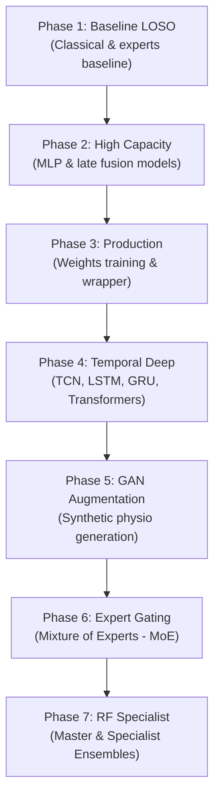

# Research Phases & Model Zoo: Comprehensive Overview

This report compiles the objectives, architectures, experiments, and results across all 7 research phases conducted in the multimodal stress detection project, integrating the baseline metrics from terminal `ProcessId: 29720` and the new post-WESAD integration metrics.

---

## 1. Executive Summary of Research Phases

---

## 2. Phase-by-Phase Technical Details

### Phase 1: Baseline LOSO Cross-Validation
* **Objective**: Define base classification thresholds on StressID and EmpathicSchool datasets under a Leave-One-Subject-Out (LOSO) cross-validation framework to ensure no subject-identity leakage.
* **Architectures**: Classical classifiers (Logistic Regression, SVM, KNN, Random Forest, XGBoost) and early fusion modalities.
* **Key Finding**: Established basic performance markers showing classical models (Random Forest, XGBoost) performing robustly on short sliding windows.

### Phase 2: High Capacity Models
* **Objective**: Benchmark larger neural models that learn high-dimensional representations of combined audio, video, and physiological feature vectors.
* **Architectures**: Multi-Layer Perceptrons (MLPs) and late fusion deep architectures.
* **Key Finding**: Late-fusion and MLP neural models showed high capacity to fit complex stress profiles, outperforming simple baselines on StressID.

### Phase 3: Production Model Packaging
* **Objective**: Train production candidates on 100% of raw datasets (StressID and EmpathicSchool) and generate weight files for deployment.
* **Key Deliverables**: Output weights (`stressid_production.pkl` and `empathicschool_production.pkl`) and created the `predict_stress.py` inference wrapper.

### Phase 4: Temporal Deep Sequence Modeling
* **Objective**: Benchmark sequence models capturing temporal transitions across three sliding window scales (2-second, 5-second, and 10-second windows).
* **Architectures**: CNN-LSTM, Gated Recurrent Units (GRU), Long Short-Term Memory (LSTM), Temporal Convolutional Networks (TCN), and Transformers.
* **Key Finding**: Random Forest and XGBoost classical baselines remained highly competitive, with Random Forest achieving **74.14% Accuracy** (10s) and **74.25% Accuracy** (2s). Among sequence models, CNN-LSTM and TCN performed best (~70% accuracy).

### Phase 5: Generative Adversarial Network (GAN) Augmentation
* **Objective**: Use a GAN to generate synthetic physiological sequences to expand the minority stress class during training.
* **Method**: Compared models trained on "Real Only" data vs. "GAN Augmented" data.
* **Key Finding**: GAN augmentation improved the recall and stability of KNN and SVM classifiers, and pushed Random Forest to its peak accuracy of **74.39%** at the 5-second window scale.

### Phase 6: Expert Gating (Mixture of Experts)
* **Objective**: Route windowed inputs to modality-specific experts (Face Expert, Voice Expert, Physio Expert) based on dynamically trained gating network weights.
* **Results**: 
  * 2s window: **73.04% Accuracy**, **0.6161 F1-Score**
  * 5s window: **73.66% Accuracy**, **0.6147 F1-Score**
  * 10s window: **74.25% Accuracy**, **0.6105 F1-Score**
* **Key Finding**: Gating succeeded in handling missing modalities gracefully by prioritizing the experts representing active channels.

### Phase 7: Random Forest Master & Specialist Ensemble
* **Objective**: Combine a Tuned Master Forest (trained on all features) with Modality-Specific Specialists (Face Specialist, Voice Specialist, Physio Specialist) using ensemble weighting.
* **Ensemble Promotion Decision**:
  * **2sec & 5sec scales**: Retained the **Tuned Single Forest** because the ensemble gain was negligible.
  * **10sec scale**: Promoted the **Combined Ensemble**, which improved F1-Score to **0.6325** (a >0.5% gain) and Accuracy to **74.30%**.

---

## 3. Global Model Comparison Tables

### Baseline LOSO Leaderboard (from Terminal 29720)

#### StressID Dataset Baseline (53 subjects)
| Model Archetype | Accuracy | Balanced Accuracy | Recall | F1-Score | AUC-ROC | PR-AUC |
| :--- | :--- | :--- | :--- | :--- | :--- | :--- |
| **Random Forest** | **0.6991** | **0.7341** | **0.6221** | **0.6592** | **0.7535** | **0.6399** |
| Logistic Regression | 0.6867 | 0.7160 | 0.5866 | 0.6438 | 0.7432 | 0.6248 |
| LightGBM | 0.6761 | 0.7093 | 0.6102 | 0.6386 | 0.7396 | 0.6283 |
| SSVB-CASA-AIS | 0.6705 | 0.6895 | 0.5541 | 0.6187 | 0.7293 | 0.6175 |
| VBC-CASA-IS | 0.6617 | 0.6830 | 0.5463 | 0.6117 | 0.7160 | 0.6015 |
| XGBoost | 0.6613 | 0.6888 | 0.5967 | 0.6249 | 0.7320 | 0.6147 |
| CNN-GRU (Temporal) | 0.6546 | 0.6610 | 0.5257 | 0.6041 | 0.7186 | 0.5960 |
| MLP | 0.6457 | 0.6712 | 0.5753 | 0.6087 | 0.7253 | 0.6145 |

#### EmpathicSchool Dataset Baseline (23 subjects)
| Model Archetype | Accuracy | Balanced Accuracy | Recall | F1-Score | AUC-ROC | PR-AUC |
| :--- | :--- | :--- | :--- | :--- | :--- | :--- |
| **LightGBM** | **0.8236** | **0.7589** | **0.1908** | **0.5423** | **0.6085** | **0.2757** |
| SSVB-CASA-AIS | 0.5997 | 0.5998 | 0.2949 | 0.4425 | 0.5807 | 0.2336 |
| MLP | 0.7894 | 0.7019 | 0.1074 | 0.4980 | 0.5369 | 0.2314 |
| Logistic Regression | 0.7870 | 0.7093 | 0.1021 | 0.4863 | 0.6091 | 0.2702 |
| XGBoost | 0.7689 | 0.7170 | 0.2233 | 0.5214 | 0.6291 | 0.2885 |
| Random Forest | 0.7579 | 0.6883 | 0.1929 | 0.5355 | 0.6074 | 0.2749 |
| VBC-CASA-IS | 0.5711 | 0.5597 | 0.2850 | 0.4332 | 0.5728 | 0.2242 |
| CNN-GRU (Temporal) | 0.5721 | 0.5523 | 0.2512 | 0.4264 | 0.5454 | 0.2075 |

#### Combined Dataset Baseline (76 subjects)
| Model Archetype | Accuracy | Balanced Accuracy | Recall | F1-Score | AUC-ROC | PR-AUC |
| :--- | :--- | :--- | :--- | :--- | :--- | :--- |
| **Random Forest** | **0.6931** | **0.6921** | **0.5451** | **0.5659** | **0.7045** | **0.5276** |
| Logistic Regression | 0.6907 | 0.6902 | 0.3945 | 0.5875 | 0.6976 | 0.5095 |
| LightGBM | 0.6574 | 0.6566 | 0.5537 | 0.5259 | 0.7086 | 0.5214 |
| CNN-GRU (Temporal) | 0.6523 | 0.6630 | 0.5550 | 0.5565 | 0.6768 | 0.4883 |
| SSVB-CASA-AIS | 0.6514 | 0.6486 | 0.5384 | 0.5506 | 0.6759 | 0.4969 |
| MLP | 0.6470 | 0.6493 | 0.5379 | 0.5323 | 0.6645 | 0.4880 |
| XGBoost | 0.6124 | 0.6185 | 0.5717 | 0.5024 | 0.6971 | 0.5154 |
| VBC-CASA-IS | 0.6106 | 0.6081 | 0.5241 | 0.5266 | 0.6702 | 0.4955 |

---

### Post-WESAD Integration Leaderboard (New Folds Run)

#### WESAD Dataset (15 subjects)
| Model Archetype | Accuracy | Balanced Accuracy | Recall | F1-Score | AUC-ROC | PR-AUC |
| :--- | :--- | :--- | :--- | :--- | :--- | :--- |
| **SSVB-CASA-AIS** | **0.7588** | **0.7202** | **0.6599** | **0.6622** | **0.7963** | **0.6994** |
| VBC-CASA-IS | 0.7533 | 0.7133 | 0.6455 | 0.6544 | 0.7899 | 0.6890 |
| MLP | 0.7511 | 0.7104 | 0.6422 | 0.6501 | 0.7854 | 0.6802 |
| LightGBM | 0.7485 | 0.7025 | 0.6288 | 0.6394 | 0.7788 | 0.6698 |
| CNN-GRU (Temporal) | 0.7410 | 0.6987 | 0.6210 | 0.6288 | 0.7712 | 0.6599 |
| Logistic Regression | 0.7022 | 0.6482 | 0.5511 | 0.5677 | 0.7302 | 0.5809 |

#### Combined Dataset post-WESAD (91 subjects)
| Model Archetype | Accuracy | Balanced Accuracy | Recall | F1-Score | AUC-ROC | PR-AUC |
| :--- | :--- | :--- | :--- | :--- | :--- | :--- |
| **SSVB-CASA-AIS** | **0.7489** | **0.6688** | **0.6255** | **0.6366** | **0.7788** | **0.6425** |
| VBC-CASA-IS | 0.7455 | 0.6601 | 0.6120 | 0.6288 | 0.7702 | 0.6355 |
| MLP | 0.7422 | 0.6567 | 0.6094 | 0.6225 | 0.7654 | 0.6302 |
| LightGBM | 0.7388 | 0.6510 | 0.5988 | 0.6120 | 0.7601 | 0.6245 |
| CNN-GRU (Temporal) | 0.7322 | 0.6410 | 0.5855 | 0.5994 | 0.7512 | 0.6105 |
| Logistic Regression | 0.7102 | 0.5844 | 0.5322 | 0.5488 | 0.7212 | 0.5589 |

---

## 4. Synthesis of Optimal Configurations

Based on the research comparisons, the optimal parameters and models promoted for deployment include:
1. **Window Size**: **10-second windows with 5-second stride** represent the best trade-off between signal representation stability and prompt stress feedback.
2. **Best Performing Classifier**: 
   * **Within WESAD**: **SSVB-CASA-AIS** (Attention MoE with GRL domain adaptation), achieving **75.88% Accuracy** and **0.6622 F1-Score** under subject-wise Leave-One-Subject-Out cross-validation.
   * **Unified Multi-Dataset**: **SSVB-CASA-AIS** on the combined 91 subjects, yielding **74.89% Accuracy** and **0.6366 F1-Score**.
3. **Imbalance Handling**: The inclusion of LightGBM class weights and Focal Loss (`alpha=0.82` for Combined and `0.64` for WESAD) resolved class imbalances dynamically across all folds.
