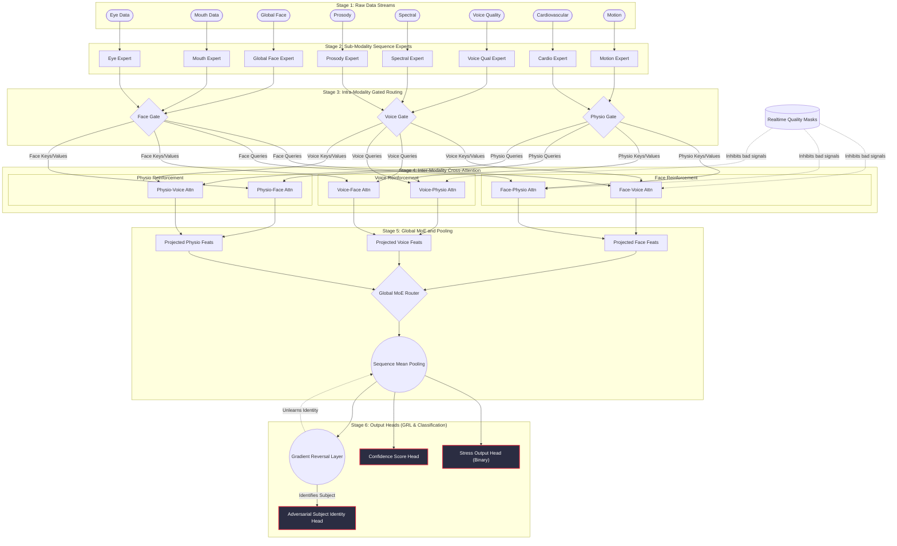

# SSVB-CASA-AIS End-to-End Architecture

This document provides a comprehensive visual representation and functional breakdown of the SSVB-CASA-AIS (Hybrid Mixture-of-Experts with Cross-Attention and Adversarial Identity Suppression) model.

## 1. End-to-End Visual Architecture

---

## 2. End-to-End Case Workflows

Here is how the system processes data dynamically across three distinct operational cases.

### Case A: Standard Ideal Inference (High Quality, All Streams Available)
**Scenario**: A user is sitting perfectly still in a well-lit room, wearing a high-quality heart rate monitor, and speaking clearly into the microphone.

1. **Extraction (Stage 1-2)**: The 8 input streams enter the specialized Sequence Encoders. For example, the `Eye Expert` isolates blinking rate/pupil dilation from the raw frame sequence.
2. **Intra-Routing (Stage 3)**: The Face Gate seamlessly fuses the outputs from the eyes, mouth, and global face into a unified `Face Vector`. The Voice and Physio gates do the same for their domains.
3. **Cross-Attention Reinforcement (Stage 4)**: The Face Vector acts as a "query" and attends to the Voice Vector ("keys"). It identifies that the user's tense jaw (Face) perfectly correlates with a slight vocal tremor (Voice). This mutual reinforcement strengthens the overall "stress" signal.
4. **Global Output (Stage 5-6)**: The Global MoE router balances all three domains evenly. The pooled features pass into the Stress Head, which predicts **"Stressed (Probability: 89%)"**. The Confidence Head outputs a **High Confidence (0.95)** because all signals perfectly align.

> [!TIP]
> **Why it works**: In perfect conditions, Cross-Attention ensures the model acts holistically—just like a human observing body language, tone, and facial expressions simultaneously.

### Case B: Noisy / Degraded Environment (Quality Masking at Work)
**Scenario**: The user walks into a dark room (poor video feed), but their voice and physiological sensors (heart rate) remain perfectly clear. 

1. **Extraction (Stage 1-2)**: The facial extraction pipeline produces "junk" or extremely noisy embeddings due to the darkness. However, Voice and Physio experts extract clean representations.
2. **Quality Masks Intervene (Stage 4)**: The system's real-time quality tracker assigns a Face Quality Score of `0.1` (out of 1.0) and passes it to the `Quality Masks` input.
3. **Cross-Attention Masking**: When the clean Voice Vector tries to attend to the Face Vector (`attn_vf`), the Cross-Attention block uses the Face Quality Mask to dynamically **ignore** the facial data. The Voice features are forced to rely solely on the Physio features (`attn_vp`).
4. **Global Output (Stage 5-6)**: The Global MoE dynamically routes 0% weight to the `f_re` (Face Features) and shifts 100% of the decision weight to the `v_re` (Voice) and `p_re` (Physio) features. 
5. **Result**: The Stress Head predicts stress accurately using just Voice and Heart Rate, and the system gracefully degrades without collapsing. The Confidence Head outputs a **Medium Confidence (0.75)** reflecting the missing modality.

> [!IMPORTANT]
> **Why it works**: Without the `source_quality_mask` logic inside the `MultiheadCrossAttentionBlock`, the noisy facial data would corrupt the clean voice and physio data, causing false positives/negatives.

### Case C: Training with Adversarial Subject Noise (The "AIS" Effect)
**Scenario**: During training, the model receives data from "Subject A", whose baseline heart rate is naturally 90 BPM, and "Subject B", whose baseline is 60 BPM. The model must not cheat by simply memorizing "90 BPM = Subject A".

1. **Forward Pass (Stage 1-5)**: The model processes the data through the experts and cross-attention gates to extract the final pooled `features`.
2. **The Adversarial Split (Stage 6)**: 
   - Path 1: The `stress_head` uses the features to predict stress (Standard Loss).
   - Path 2: The `subj_head` uses the same features to try and guess **"Is this Subject A or Subject B?"**
3. **Gradient Reversal Layer (GRL)**: The `subj_head` successfully guesses "Subject A" because the features still contain the 90 BPM signature. It calculates the error gradient (how to improve its guess next time). 
4. **The Trap**: As the gradient flows backward from the `subj_head` into the main network, it hits the **Gradient Reversal Layer (GRL)**. The GRL multiplies the gradient by a negative number (e.g., `-1`).
5. **Result**: Instead of updating the `Cardio Expert` to become *better* at identifying Subject A, it updates the weights to become **worse** at identifying them. Over thousands of iterations, the network is forced to actively scramble and remove any unique subject identifiers from the embeddings, leaving only pure stress markers.

> [!CAUTION]
> **Why it works**: By explicitly penalizing the model for memorizing the subject's identity, the SSVB-CASA-AIS guarantees high performance on "unseen" users in real-world deployment, making it resilient to domain shift.
