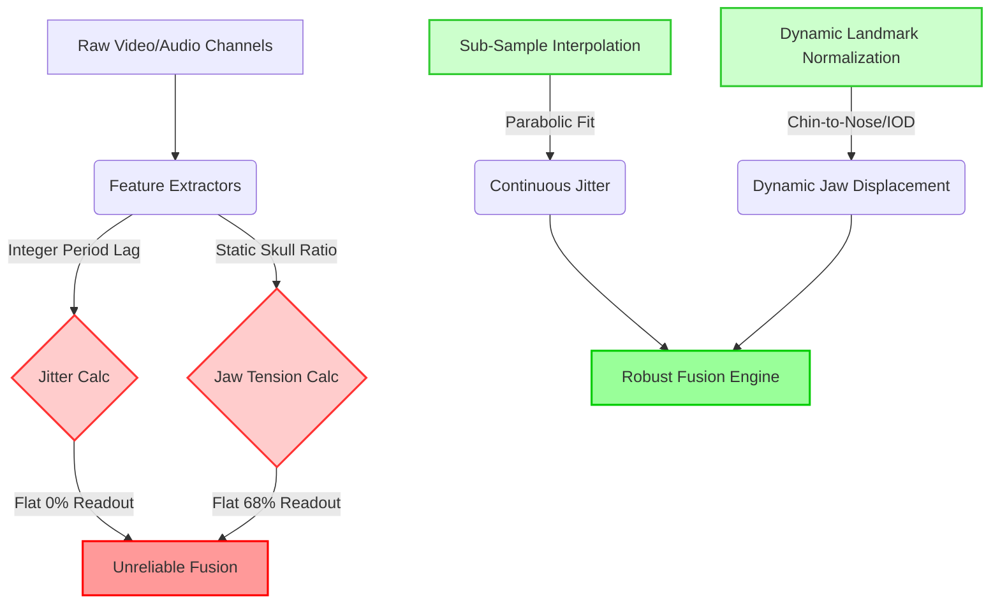

# Multimodal Stress Detection: Pattern Recognition & Feature Extraction Reliability Report

This report analyzes the core mathematical, physiological, and machine learning pattern recognition flaws in the **StressDetectionUsingML** codebase that lead to:
1. **Flat-line / constant readouts** for `jitter_percent` and `jaw_tension`.
2. **False-positive voice stress scores (98%–99%)** during normal speech.
3. **Erratic/unstable facial stress predictions** when laughing.

---

## Executive Summary

While the models achieve high validation metrics during offline training on static datasets (such as *StressID* or pre-collected image folders), they exhibit significant instability under real-time conditions. This disconnect is caused by **discrete mathematical approximations** of continuous vocal micro-tremors, **static anthropometric ratio definitions**, **out-of-distribution microphone/channel scaling**, and a **binary classification boundary** that cannot differentiate between high-arousal positive emotions (laughter) and high-arousal negative emotions (stress).

---

## 1. The "Flat-line" Jitter and Shimmer Readings

### The Symptoms
In the frontend dashboard, the `Jitter` indicator remains frozen at `0.00%` or shows static values, and rarely fluctuates dynamically during speech.

### The Code-Level Cause
In [voice_worker.py](file:///e:/Document/GitHub/StressDetectionUsingML/backend/voice_worker.py#L57-L86) (and identically in [colab_training.py](file:///e:/Document/GitHub/StressDetectionUsingML/backend/colab_training.py#L275-L301)), pitch periods are extracted frame-by-frame via discrete autocorrelation:

```python
# From voice_worker.py
for frame in frames.T:
    ac = np.correlate(frame, frame, mode='full')[frame_len - 1:]
    ac = ac / (ac[0] + EPS)
    min_lag = int(sr / 500)  # 32 samples (at 16kHz)
    max_lag = int(sr / 60)   # 266 samples (at 16kHz)
    if max_lag < len(ac):
        peak_idx = np.argmax(ac[min_lag:max_lag]) + min_lag
        periods.append(peak_idx) # <-- INTEGER LAG INDEX STORED HERE
```

The fundamental math of jitter (vocal frequency instability) is calculated as:
$$\text{Jitter} = \frac{\frac{1}{N-1}\sum_{i=1}^{N-1}|P_i - P_{i+1}|}{\frac{1}{N}\sum_{i=1}^{N}P_i}$$

Where $P_i$ is the pitch period of the $i$-th frame.

### Why It Fails
1. **Integer Binning without Interpolation**: `periods` stores discrete integer indices of the peak lag in samples. At $16\text{ kHz}$, one sample represents exactly $\frac{1}{16000} = 62.5\text{ microseconds}$.
2. **Coarse Frequency Steps**: If a user speaks at a stable pitch of $150\text{ Hz}$, the true physical period is $106.67$ samples. Because `np.argmax` can only return integers, the algorithm snaps `peak_idx` to `107` samples for every single frame. 
   - Consequently, the array of periods is `[107.0, 107.0, 107.0, 107.0, ...]`.
   - The first difference `np.diff(periods)` is `[0.0, 0.0, 0.0, ...]`.
   - Therefore, `jitter` evaluates to **exactly 0.0%**.
3. **Step-Function Spikes**: If the pitch changes enough to cross the rounding boundary (e.g., from $107$ to $108$), `np.diff` registers a step of exactly `1.0`. A jump of $1$ sample at $107$ samples represents a sudden artificial jitter spike of $\frac{1}{107} \approx 0.93\%$. Since micro-vocal jitter is physically a continuous variation between $0.1\%$ and $0.8\%$, this discrete binning makes it impossible to measure real-time vocal jitters smoothly.

### Recommended Fix: Parabolic Peak Interpolation
To resolve sub-sample precision, fit a parabola to the three correlation points around the discrete maximum peak $k_m = \text{argmax}(AC)$. The fractional adjustment $\delta$ is:

$$\delta = \frac{1}{2} \cdot \frac{AC[k_m - 1] - AC[k_m + 1]}{AC[k_m - 1] - 2AC[k_m] + AC[k_m + 1]}$$

The refined period is $P = k_m + \delta$.

```python
# Refined Peak Extraction with Parabolic Interpolation
discrete_peak = np.argmax(ac[min_lag:max_lag]) + min_lag
if discrete_peak > min_lag and discrete_peak < max_lag - 1:
    y1 = ac[discrete_peak - 1]
    y2 = ac[discrete_peak]
    y3 = ac[discrete_peak + 1]
    denom = (y1 - 2*y2 + y3)
    if abs(denom) > 1e-5:
        delta = 0.5 * (y1 - y3) / denom
        refined_period = discrete_peak + delta
    else:
        refined_period = float(discrete_peak)
else:
    refined_period = float(discrete_peak)
periods.append(refined_period)
```

---

## 2. Static "Jaw Tension" (Muscle Rigidity vs. Skull Structure)

### The Symptoms
The frontend UI displays a continuous, unchanging value for `Jaw Tension` (usually around $68\%$), regardless of whether the user is speaking, clenching their teeth, or relaxing.

### The Code-Level Cause
In [FaceStream.jsx](file:///e:/Document/GitHub/StressDetectionUsingML/frontend/src/components/FaceStream.jsx#L13-L14) and [colab_training.py](file:///e:/Document/GitHub/StressDetectionUsingML/backend/colab_training.py#L189-L190), `jawTension` is calculated as follows:

```javascript
// From FaceStream.jsx
const faceH = dist(pt(10), pt(152)) + 1e-6; // Hairline center to chin center
const faceW = dist(pt(234), pt(454)) + 1e-6; // Left cheekbone to right cheekbone

// Jaw tension
const jawTension = faceW / faceH;
```

| Landmark ID | Anatomical Location | Skeletal Anchor |
| :--- | :--- | :--- |
| **10** | Forehead hairline center | Frontal bone (Rigid) |
| **152** | Chin center (Menton) | Mandible (Rotates vertically) |
| **234** | Left zygion / cheek arch | Zygomatic bone (Rigid) |
| **454** | Right zygion / cheek arch | Zygomatic bone (Rigid) |

### Why It Fails
1. **Skeletal Aspect Ratio**: The width of the zygomatic arches (`faceW`) is a fixed skeletal feature. The distance from the hairline to the chin (`faceH`) changes by less than $5\%$ during chewing or speaking, and **does not change at all** during isometric jaw clenching. 
2. **Pose Dependency**: The ratio `faceW / faceH` represents the user's permanent cranial aspect ratio. It remains constant unless the head tilts forward or backward, which changes the 2D camera projection of the face (acting as a head-tilt sensor rather than a stress sensor).
3. **No Masseter Muscle Tracking**: Muscle tension (specifically in the masseter muscle near the jaw angle) causes minor local skin deformations but does not alter the distance between the cheekbones and the chin.

### Recommended Fix: Normalized Chin-Nose Displacement
To track true mouth openings and jaw movements, measure the vertical distance between the nose tip (`pt(4)`) and the chin (`pt(152)`), normalized by a stable, non-moving facial segment such as the inter-ocular distance (`iod = dist(pt(33), pt(263))`):

```javascript
// Relative Jaw displacement ratio (lower value = open mouth / dropped jaw)
const stableIOD = dist(pt(33), pt(263)) + 1e-6;
const jawDisplacement = dist(pt(4), pt(152)) / stableIOD;
```
For true masseter clenching, one would need to measure the distance between the corners of the jaw (`pt(172)` and `pt(397)`) relative to the cheekbones, though this remains highly sensitive to facial fat and camera perspective.

---

## 3. High Voice Stress (98%–99%) on Normal Speech

### The Symptoms
Even when speaking in a calm, flat tone, the real-time voice expert model classifies the voice as being at $98\% - 99\%$ stress.

### The Code-Level Cause
The voice features extracted from a 2-second audio chunk are scaled using a pre-trained `StandardScaler` from the *StressID* dataset and passed to a `GradientBoostingClassifier` in [app.py](file:///e:/Document/GitHub/StressDetectionUsingML/backend/app.py#L638-L640):

```python
# From app.py
features = result['features'].reshape(1, -1)
features_scaled = voice_scaler.transform(features)
score = float(voice_expert.predict_proba(features_scaled)[0][1])
```

### Why It Fails
1. **Out-of-Distribution Calibration**:
   - The `StandardScaler` was fit during training on studio-quality or specific headset microphone recordings from the *StressID* dataset.
   - Real-world parameters like **microphone gain**, **analog-to-digital converter (ADC) noise floors**, and **room reverberation** alter features like `voice_intensity` (RMS energy) and `high_freq_ratio` (energy above 3000Hz).
   - If the user's room has high-frequency fan noise, or if their microphone gain is high, the extracted features fall far outside the training distribution. The scaling transformation maps these to massive Z-scores (e.g., intensity Z-score $> +5.0$), causing the Gradient Boosting tree structures to output extreme probabilities ($98\% - 99\%$).
2. **Absolute Feature Bias (Gender & Pitch)**:
   - Features like `f0_mean` (fundamental frequency) are absolute values in Hertz.
   - A normal, calm female voice naturally sits between $180\text{ Hz}$ and $250\text{ Hz}$. A stressed male voice might also rise to $180\text{ Hz}$ or $200\text{ Hz}$.
   - Because the model uses absolute features rather than relative ones, it is highly likely to misclassify a calm female speaker as highly stressed because her baseline pitch matches the "stressed" pitch profiles of male subjects in the training set.

### Recommended Fix: Dynamic Baseline Calibration
Instead of relying on absolute scalar features, the backend should implement a **calm baseline calibration step** (e.g., a 5-second silence + normal reading task when launching the app) to measure the user's specific baseline pitch $\mu_{f0}$ and average RMS volume. Features should then be normalized relative to the user's baseline before classification:

$$f0_{\text{normalized}} = \frac{f0_{\text{measured}} - \mu_{f0}}{\sigma_{f0}}$$

---

## 4. Erratic Face Stress during Laughter

### The Symptoms
When the user laughs, the facial stress score fluctuates wildly between extremely high and extremely low.

### The Code-Level Cause
Laughter and stress expressions share overlapping muscle activations (known as **Arousal Overlaps** in facial expression analysis).

### Why It Fails
1. **Geometric Feature Overlap**:
   - During a hearty laugh (Duchenne smile), the orbicularis oculi muscles contract, squinting the eyes. This lowers the Eye Aspect Ratio (`avg_ear`).
   - At the same time, the zygomaticus major pulls the mouth corners back and up, which increases the `mouth_corner_pull` indicator.
   - During stress, pain, or high concentration, a user also squints their eyes (low `avg_ear`) and grimaces (pulls mouth corners back).
   - Because the geometric indicators of laughter and stress look almost identical to a simple feature extractor, the model cannot distinguish between positive arousal (laughter) and negative arousal (stress).
2. **Binary Dataset Limitations**:
   - The lightweight face model is trained on a binary dataset (`facesData` containing folders `stress` and `nostress`).
   - The `nostress` dataset primarily contains neutral, calm, unexpressive faces.
   - When a user laughs, their face deviates heavily from the neutral template. Lacking a third "happy/laughter" class, the binary classifier categorizes any high-activation facial deformation as "Stress".
   - The rapid, dynamic changes of a laugh cause features to oscillate across the decision boundary of the Gradient Boosting trees, leading to the observed instability.

### Recommended Fix: Multi-Class Emotion Filter
1. **Incorporate Valence**: Introduce a simple mouth-curvature aspect ratio or smile heuristic (like the Haar Cascade fallback in `model.py` or a dedicated valence-detection landmark ratio) to detect happiness/laughter. If a smile is active, temporarily inhibit or apply a dampening factor to the facial stress probability:

```python
# Dampen stress score if smile/laughter is active
if smile_detected:
    facial_stress_score = max(0.0, facial_stress_score - 0.4)
```

2. **Temporal Smoothing**: Implement a running median filter over a 3-second window to prevent rapid oscillations caused by sudden, brief micro-expressions.

---

## Summary of Architectural Action Items

> [!IMPORTANT]
> To transform the current prototype into a clinical-grade stress monitoring application, the following system updates are recommended:



1. **Implement sub-pixel parabolic peak interpolation** in the vocal autocorrelation algorithm.
2. **Redefine the Jaw Tension feature** to track relative vertical chin movement normalized by the inter-ocular distance.
3. **Establish a 3-second baseline calibration** at startup to normalize speaker-dependent pitch ($F_0$) and microphone volume levels.
4. **Deploy a multi-class classification layer** or smile-dampening heuristic to prevent laughter/happiness from being falsely classified as stress.
