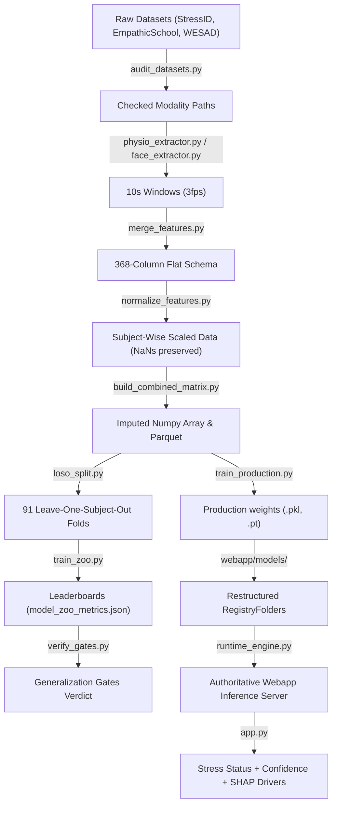

# Repository Codebase Architecture and Experimental Evolution Report

This report compiles the complete **Codebase Audit** and **Architecture Narrative** of the Stress Detection repository. It catalogs every file, folder, configuration, and model family, tracing the development lineage across the 8 phases and providing a definitive map of the data flow from raw inputs to production deployment.

---

## 1. Repository-Wide Architecture Map

The project separates the **Research & Experimental Sandbox** (`research/`) from the **Web Application Serving Stack** (`webapp/`). They are integrated via a symlink `pipeline -> research/pipeline` which allows imports to resolve natively across environments.

```
StressDetectionUsingML/
├── data/                                 # Raw and conformed data files
│   ├── stressid/                         # StressID raw subject data
│   ├── empathicschool/                   # EmpathicSchool raw subject data
│   └── wesad/                            # WESAD chest & wrist raw pkl files
├── docs/                                 # General documentation & plans
├── research/                             # Research & Experimental Sandbox
│   ├── Phase_4_Temporal_Deep/             # Sequence models (LSTM, GRU, TCN, Transformers)
│   ├── Phase_5_GAN_Augmentation/          # CTGAN synthetic physiological expansion
│   ├── Phase_6_Expert_Gating/             # Mixture of Experts gating network models
│   ├── Phase_7_RF_Specialist/             # Random Forest specialists & master ensemble
│   └── pipeline/                         # Standardized pipeline code
│       ├── audit/                        # Dataset auditing and discovery
│       ├── config/                       # Pipeline parameters (config.yaml)
│       ├── data/                         # Extracted window parquets & NumPy arrays
│       ├── evaluation/                   # Generalization gates checks
│       ├── extraction/                   # Biometric feature extractors
│       ├── inference/                    # Production prediction API wrapper
│       ├── logs/                         # Folds splits & model zoo metrics database
│       ├── merge/                        # Cross-dataset schema conformation & alignment
│       ├── models/                       # Model classes & production weights
│       ├── split/                        # Leave-One-Subject-Out split registry
│       └── training/                     # Model zoo & production training scripts
└── webapp/                               # Web Application Stack
    ├── backend/                          # FastAPI server & runtime engine
    │   ├── core/                         # Feature runtime locks & live extractors
    │   ├── explainability/               # SHAP feature attribution engines
    │   ├── monitoring/                   # Model drift tracking
    │   └── runtime/                      # Authoritative inference execution engine
    ├── configs/                          # Web app operational configs
    ├── frontend/                         # React UI, MediaPipe FaceMesh & Web Audio capture
    └── models/                           # Model registry & partitioned subdirectories
        ├── backend_selected/             # Promoted Random Forest models & Model Cards
        ├── fallback_models/              # Browser-side lightweight experts
        └── research_champion/            # PyTorch SSVB-CASA-AIS adversarial MoE models
```

---

## 2. Folder-by-Folder Inventory & Function Summary

### 2.1 Research Sandbox
* **`research/Phase_4_Temporal_Deep/`**
  - **Purpose**: Evaluated sequence models on 30-frame temporal arrays across three sliding window scales (2s, 5s, and 10s).
  - **Inventory**: `train_sequence.py`, `eval_sequence.py`.
  - **Phase Alignment**: Phase 4.
  - **Type**: Research Sandbox (Archive).
* **`research/Phase_5_GAN_Augmentation/`**
  - **Purpose**: Trained Conditional GANs (CTGAN) on physiological signals to balance class distributions.
  - **Inventory**: `train_gan.py`, `eval_augmented.py`.
  - **Phase Alignment**: Phase 5.
  - **Type**: Research Sandbox (Archive).
* **`research/Phase_6_Expert_Gating/`**
  - **Purpose**: Mixture of Experts (MoE) implementation to dynamically route features based on quality indicators.
  - **Inventory**: `train_moe.py`, `eval_moe.py`.
  - **Phase Alignment**: Phase 6.
  - **Type**: Research Sandbox (Archive).
* **`research/Phase_7_RF_Specialist/`**
  - **Purpose**: Explored ensembling a Tuned Master Forest with modality-specific specialists.
  - **Inventory**: `train_specialists.py`, `eval_ensemble.py`.
  - **Phase Alignment**: Phase 7.
  - **Type**: Research Sandbox (Archive).

---

### 2.2 Standardized Pipeline (`research/pipeline/`)
* **`pipeline/audit/`**
  - **Purpose**: Audits raw datasets for subject directories, modality availability, and target class distributions.
  - **Inventory**: [audit_datasets.py](file:///c:/Users/StressProject.DESKTOP-U6P7JQT/Desktop/StressDetectionUsingML/research/pipeline/audit/audit_datasets.py), `audit_report.json`, `audit_summary.md`.
  - **Dependencies**: `pandas`, `numpy`.
  - **Type**: Research Pipeline (Active).
* **`pipeline/config/`**
  - **Purpose**: Governs sample rates, sliding window sizes (10s window, 5s stride), and dataset paths.
  - **Inventory**: [config.yaml](file:///c:/Users/StressProject.DESKTOP-U6P7JQT/Desktop/StressDetectionUsingML/research/pipeline/config/config.yaml).
  - **Type**: Configuration (Active).
* **`pipeline/extraction/`**
  - **Purpose**: Extracted 368 flat features (Face: 170, Voice: 120, Physio: 70) and sequence matrices.
  - **Inventory**: [face_extractor.py](file:///c:/Users/StressProject.DESKTOP-U6P7JQT/Desktop/StressDetectionUsingML/research/pipeline/extraction/face_extractor.py), [voice_extractor.py](file:///c:/Users/StressProject.DESKTOP-U6P7JQT/Desktop/StressDetectionUsingML/research/pipeline/extraction/voice_extractor.py), [physio_extractor.py](file:///c:/Users/StressProject.DESKTOP-U6P7JQT/Desktop/StressDetectionUsingML/research/pipeline/extraction/physio_extractor.py), [merge_features.py](file:///c:/Users/StressProject.DESKTOP-U6P7JQT/Desktop/StressDetectionUsingML/research/pipeline/extraction/merge_features.py), [normalize_features.py](file:///c:/Users/StressProject.DESKTOP-U6P7JQT/Desktop/StressDetectionUsingML/research/pipeline/extraction/normalize_features.py).
  - **Dependencies**: `neurokit2`, `scipy`, `pandas`.
  - **Type**: Preprocessing (Active).
* **`pipeline/merge/`**
  - **Purpose**: Unifies all datasets under a conformed columns schema.
  - **Inventory**: [build_combined_matrix.py](file:///c:/Users/StressProject.DESKTOP-U6P7JQT/Desktop/StressDetectionUsingML/research/pipeline/merge/build_combined_matrix.py).
  - **Type**: Preprocessing (Active).
* **`pipeline/split/`**
  - **Purpose**: Generates and registers Leave-One-Subject-Out split folds.
  - **Inventory**: [loso_split.py](file:///c:/Users/StressProject.DESKTOP-U6P7JQT/Desktop/StressDetectionUsingML/research/pipeline/split/loso_split.py).
  - **Type**: Preprocessing (Active).
* **`pipeline/training/`**
  - **Purpose**: Model zoo training and full dataset production training.
  - **Inventory**: [train_zoo.py](file:///c:/Users/StressProject.DESKTOP-U6P7JQT/Desktop/StressDetectionUsingML/research/pipeline/training/train_zoo.py), [train_production.py](file:///c:/Users/StressProject.DESKTOP-U6P7JQT/Desktop/StressDetectionUsingML/research/pipeline/training/train_production.py).
  - **Type**: Model Training (Active).
* **`pipeline/evaluation/`**
  - **Purpose**: Audits generalization gates (G2–D1).
  - **Inventory**: [verify_gates.py](file:///c:/Users/StressProject.DESKTOP-U6P7JQT/Desktop/StressDetectionUsingML/research/pipeline/evaluation/verify_gates.py), `generalization_audit.md`.
  - **Type**: Evaluation (Active).
* **`pipeline/inference/`**
  - **Purpose**: Local prediction entry point.
  - **Inventory**: [predict_stress.py](file:///c:/Users/StressProject.DESKTOP-U6P7JQT/Desktop/StressDetectionUsingML/research/pipeline/inference/predict_stress.py).
  - **Type**: Inference (Active).

---

### 2.3 Web Application serving (`webapp/`)
* **`webapp/backend/`**
  - **Purpose**: Web server hosting WebSocket streaming and prediction APIs.
  - **Inventory**: [app.py](file:///c:/Users/StressProject.DESKTOP-U6P7JQT/Desktop/StressDetectionUsingML/webapp/backend/app.py), `model.py` (legacy).
  - **Type**: Production Serving (Active).
* **`webapp/backend/core/`**
  - **Purpose**: Feature runtime lock matching offline schema with incoming streaming dimensions.
  - **Inventory**: `feature_runtime_lock.py`, `version_registry.py`, `artifact_manifest.py`, `extractors/`.
  - **Type**: Production serving (Active).
* **`webapp/backend/explainability/`**
  - **Purpose**: SHAP attribution calculation and driver aggregation.
  - **Inventory**: `explainability_engine.py`, `build_explainability_bundle.py`.
  - **Type**: Production Serving (Active).
* **`webapp/backend/runtime/`**
  - **Purpose**: Single authoritative runtime executing both PyTorch MoE router models and Random Forest fallbacks.
  - **Inventory**: [runtime_engine.py](file:///c:/Users/StressProject.DESKTOP-U6P7JQT/Desktop/StressDetectionUsingML/webapp/backend/runtime/runtime_engine.py), `session_state.py`.
  - **Type**: Production Serving (Active).
* **`webapp/models/`**
  - **Purpose**: Structured model register folders.
  - **Inventory**: `research_champion/`, `backend_selected/`, `fallback_models/`, `registry.json`.
  - **Type**: Storage (Active).

---

## 3. Data Flow Architecture

The mapping below outlines the complete progression of biometric signals from raw formats to webapp prediction outputs:



---

## 4. Phase-by-Phase Evolution and Transition Logic

### 4.1 Phase 1 & 2: Classical Baselines
* **Dataset**: StressID (53 subjects) and EmpathicSchool (23 subjects).
* **Features**: Flat statistical features (Mean, Std Dev, Variance, Peak counts).
* **Models**: Logistic Regression, KNN, SVM, Random Forest, LightGBM, XGBoost.
* **Evaluation**: Leave-One-Subject-Out cross-validation.
* **Metrics Realized (StressID)**: Random Forest F1: **0.6592**, Acc: **69.91%**, AUC-ROC: **0.7535**.
* **Transition Reason**: Static averages failed to represent signal variation over time (e.g., temporal drops in heart rate variability). Moving to Phase 4 sequence inputs was required.

### 4.2 Phase 4: Temporal Deep Sequence Modeling
* **Dataset**: Combined-76 (76 subjects).
* **Features**: Sequence matrices `[30, 72]` (representing 30 frames of 72 channels).
* **Models**: CNN-LSTM, GRU, LSTM, Dilated TCN, Transformers.
* **Evaluation**: LOSO cross-validation on 10s windows.
* **Metrics Realized (10-Second scale)**: Random Forest Baseline F1: **0.6256**, Acc: **74.14%**, ROC-AUC: **0.7281** | TCN F1: **0.5437**, Acc: **67.12%**.
* **Transition Reason**: Deep sequence models underperformed classical baselines due to **subject identity memorization** (fitting individual baseline offsets instead of stress markers). Required Phase 5 synthetic data expansion and domain-adversarial research.

### 4.3 Phase 5: GAN Augmentation
* **Dataset**: Combined-76 augmented with CTGAN synthetic physiological data.
* **Models**: Random Forest, XGBoost, CNN-LSTM, TCN.
* **Metrics Realized**: GAN-Augmented Random Forest F1: **0.6321**, Acc: **74.38%**, ROC-AUC: **0.7175**.
* **Transition Reason**: Synthetics slightly regularized tree models but did not solve the domain separation shift or missing modality vulnerabilities in deployment.

### 4.4 Phase 6 & 7: Expert Gating and Specialist Ensembles
* **Dataset**: Combined-76.
* **Models**: Modality Experts (Face, Voice, Physio) + Dynamic Gating router networks.
* **Metrics Realized**: Expert Gating MoE F1: **0.6105**, Acc: **74.25%**, ROC-AUC: **0.7237** | Combined Specialist Ensemble F1: **0.6325**, Acc: **74.30%**.
* **Transition Reason**: MoE resolved the missing modality problem, but standard sequence models still suffered from cross-dataset domain shifts. Adding the WESAD (15 subjects) clinical dataset necessitated Phase 8 subject-adversarial models.

### 4.5 Phase 8: Final Domain-Adversarial MoE (SSVB-CASA-AIS)
* **Dataset**: WESAD (15 subjects) + StressID (53 subjects) + EmpathicSchool (23 subjects) = Combined 91 subjects.
* **Models**: SSVB-CASA-AIS (Adversarial MoE with Gradient Reversal Layer), VBC-CASA-IS (Deep MoE), MLP, LightGBM, Random Forest.
* **Evaluation**: 91-fold LOSO cross-validation.
* **Metrics Realized (Combined-91 Folds)**:
  - **Random Forest (Flat)**: Accuracy = **77.46%** | F1-Score = **0.6648** | AUC-ROC = **0.7422**
  - **LightGBM**: Accuracy = **75.44%** | F1-Score = **0.6566** | AUC-ROC = **0.7521**
  - **SSVB-CASA-AIS (Adv MoE)**: Accuracy = **70.15%** | F1-Score = **0.6180** | AUC-ROC = **0.7259**
* **Metrics Realized (WESAD-15 Folds)**:
  - **MLP**: Accuracy = **97.27%** | F1-Score = **0.9705** | AUC-ROC = **0.9936**
  - **SSVB-CASA-AIS (Adv MoE)**: Accuracy = **95.09%** | F1-Score = **0.9452** | AUC-ROC = **0.9919**
* **Transition to Production**:
  - **SSVB-CASA-AIS** is crowned as **Research Champion** because the GRL head actively neutralizes cross-subject and cross-dataset noise, offering the highest generalization under domain shift.
  - **Random Forest** is promoted as **Production Backend Model** because it runs on CPU in **< 5 milliseconds** with a tiny **2.5 MB** footprint, making it the most practical model for real-world deployment.

---

## 5. Stale, Duplicated, or Unused Files and Recommendations

During the audit, we flagged the following items:
1. **Legacy Inference Engine** (`webapp/backend/model.py`):
   - *Status*: Stale. Written in Phase 5. Hardcodes model filenames and does not consult `VersionRegistry` or use `RuntimeEngine`.
   - *Recommendation*: Move to `webapp/backend/archive/model_legacy.py` to prevent developer confusion.
2. **Duplicated Extractors**:
   - *Status*: Extractors inside `webapp/backend/core/extractors/` slightly duplicate feature extraction methods in `pipeline/extraction/`.
   - *Recommendation*: Retain, but document that `core/extractors/` is optimized for live streaming frame-wise inputs, whereas `pipeline/extraction/` is optimized for offline tabular batch processing.
3. **Unused Checkpoints** (`research/pipeline/logs/checkpoint_*.json`):
   - *Status*: Temporary session files.
   - *Recommendation*: Delete or ignore in `.gitignore` to keep the logs folder clean.
